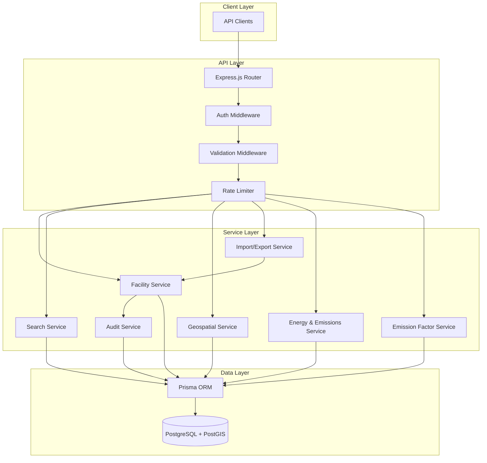
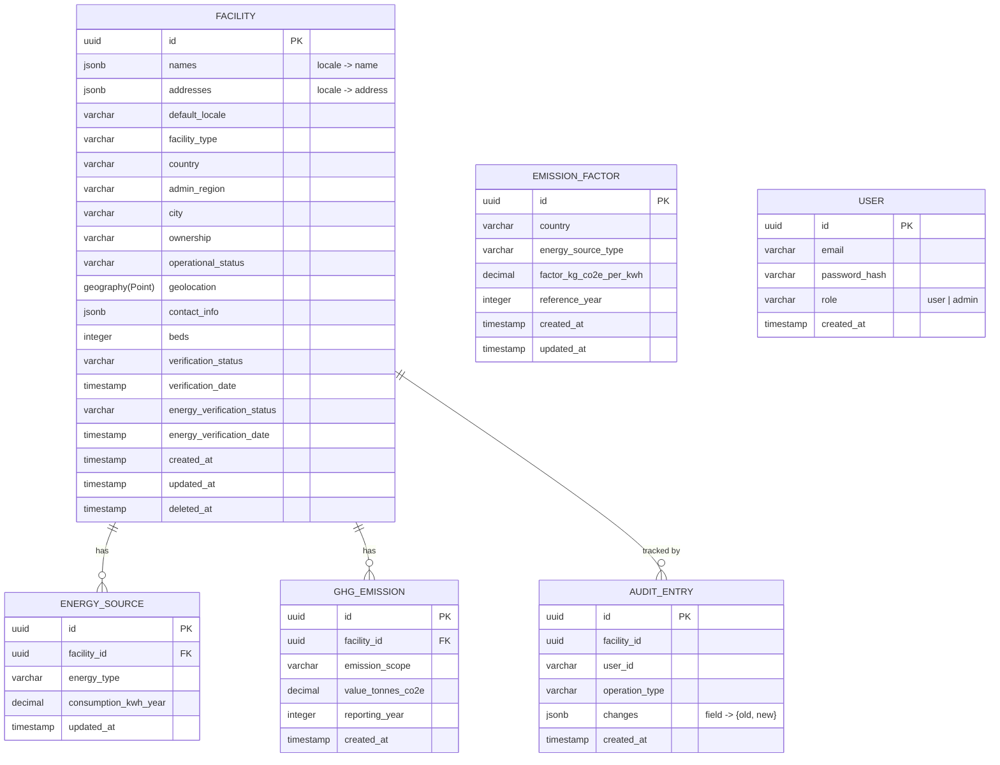

# Design Document: Africa Health Facilities Registry

## Overview

The Africa Health Facilities Registry is a RESTful API application that provides a comprehensive, searchable registry of health facilities across the African continent. The system supports CRUD operations, geospatial queries, bulk data import/export, energy profiling, GHG emissions tracking, multi-language support, data verification, and audit trails.

### Technology Stack

| Layer | Technology | Rationale |
|-------|-----------|-----------|
| Runtime | Node.js 20 LTS + TypeScript | Type safety, async I/O for handling concurrent API requests |
| Framework | Express.js | Lightweight, widely adopted, extensible middleware ecosystem |
| Database | PostgreSQL 16 + PostGIS | Robust relational DB with mature geospatial extension for proximity/bounding-box queries |
| ORM | Prisma | Type-safe database access, migrations, schema-first approach |
| Validation | Zod | Runtime schema validation with TypeScript inference |
| Authentication | JSON Web Tokens (JWT) | Stateless auth for API access, role-based claims |
| Testing | Vitest + fast-check | Unit/integration testing with property-based testing support |
| CSV Parsing | Papa Parse | RFC 4180 compliant, streaming support for large files |
| Documentation | OpenAPI 3.0 | Standard API documentation |

### Key Design Decisions

1. **PostgreSQL + PostGIS over MongoDB**: The data is highly relational (facilities → energy profiles → emissions → audit entries). PostGIS provides native geospatial indexing (ST_DWithin, ST_MakeEnvelope) that outperforms application-level distance calculations.

2. **Soft-delete for facilities**: Deleted records are marked with a `deleted_at` timestamp rather than physically removed. This preserves audit trail integrity and allows recovery.

3. **JSONB for multilingual fields**: Facility names and addresses are stored as JSONB columns keyed by locale code. This avoids a separate translations table and enables GIN indexing for cross-locale keyword search.

4. **Emission factors as a separate table**: Country-specific emission factors are stored independently from facility records, versioned by reference year, enabling temporal lookups without data duplication.

5. **Event-sourced audit trail**: Audit entries are append-only records in a dedicated table. They reference the facility by ID and are retained even after facility deletion.

---

## Architecture



### Request Flow

1. Client sends HTTP request to Express router
2. Auth middleware validates JWT for write operations (passes through for reads)
3. Validation middleware validates request body/params using Zod schemas
4. Rate limiter checks for excessive failed auth attempts
5. Router dispatches to appropriate service
6. Service executes business logic, interacts with data layer
7. Audit service records changes asynchronously
8. Response returned to client

---

## Components and Interfaces

### API Endpoints

#### Facility CRUD

| Method | Endpoint | Auth | Description |
|--------|----------|------|-------------|
| POST | `/api/v1/facilities` | Required | Create a new facility |
| GET | `/api/v1/facilities/:id` | None | Retrieve facility by ID |
| PATCH | `/api/v1/facilities/:id` | Required | Update facility fields |
| DELETE | `/api/v1/facilities/:id` | Admin | Soft-delete a facility |

#### Search & Filter

| Method | Endpoint | Auth | Description |
|--------|----------|------|-------------|
| GET | `/api/v1/facilities` | None | Search with filters & pagination |
| GET | `/api/v1/facilities/nearby` | None | Geospatial proximity search |
| GET | `/api/v1/facilities/bbox` | None | Bounding box search |

#### Bulk Operations

| Method | Endpoint | Auth | Description |
|--------|----------|------|-------------|
| POST | `/api/v1/facilities/import` | Admin | Bulk CSV import |
| GET | `/api/v1/facilities/export` | None | CSV export with filters |

#### Energy & Emissions

| Method | Endpoint | Auth | Description |
|--------|----------|------|-------------|
| PUT | `/api/v1/facilities/:id/energy-profile` | Required | Update energy profile |
| POST | `/api/v1/facilities/:id/emissions` | Required | Add GHG emissions data |
| GET | `/api/v1/facilities/:id/emissions/estimate` | None | Calculate estimated emissions |

#### Emission Factors

| Method | Endpoint | Auth | Description |
|--------|----------|------|-------------|
| POST | `/api/v1/emission-factors` | Admin | Create emission factor |
| PUT | `/api/v1/emission-factors/:id` | Admin | Update emission factor |
| DELETE | `/api/v1/emission-factors/:id` | Admin | Delete emission factor |
| GET | `/api/v1/emission-factors` | None | List emission factors |

#### Audit

| Method | Endpoint | Auth | Description |
|--------|----------|------|-------------|
| GET | `/api/v1/facilities/:id/audit` | Admin | Retrieve audit history |

### Core Service Interfaces

```typescript
// Facility Service
interface FacilityService {
  create(data: CreateFacilityInput): Promise<FacilityRecord>;
  getById(id: string): Promise<FacilityRecord>;
  update(id: string, data: UpdateFacilityInput): Promise<FacilityRecord>;
  delete(id: string, userId: string): Promise<{ id: string }>;
  search(filters: SearchFilters, pagination: PaginationParams): Promise<PaginatedResult<FacilityRecord>>;
}

// Geospatial Service
interface GeospatialService {
  findNearby(point: GeoPoint, radiusKm: number, pagination: PaginationParams): Promise<PaginatedResult<FacilityWithDistance>>;
  findInBoundingBox(sw: GeoPoint, ne: GeoPoint, pagination: PaginationParams): Promise<PaginatedResult<FacilityRecord>>;
}

// Import/Export Service
interface ImportExportService {
  importCsv(file: Buffer, userId: string): Promise<ImportReport>;
  exportCsv(filters: SearchFilters): Promise<Buffer>;
}

// Energy & Emissions Service
interface EnergyEmissionsService {
  updateEnergyProfile(facilityId: string, profile: EnergyProfileInput): Promise<EnergyProfile>;
  addEmissions(facilityId: string, data: EmissionsInput): Promise<GhgEmission>;
  estimateEmissions(facilityId: string, energySourceType: string, year: number): Promise<EmissionEstimate | null>;
}

// Emission Factor Service
interface EmissionFactorService {
  create(data: CreateEmissionFactorInput): Promise<EmissionFactor>;
  update(id: string, data: UpdateEmissionFactorInput): Promise<EmissionFactor>;
  delete(id: string): Promise<void>;
  findByCountryAndSource(country: string, sourceType: string, maxYear: number): Promise<EmissionFactor | null>;
}

// Audit Service
interface AuditService {
  record(entry: AuditInput): Promise<void>;
  getHistory(facilityId: string): Promise<AuditEntry[]>;
}
```

### Middleware Stack

```typescript
// Auth Middleware
interface AuthMiddleware {
  authenticate(req: Request, res: Response, next: NextFunction): void;  // Validates JWT, attaches user to req
  requireAdmin(req: Request, res: Response, next: NextFunction): void;  // Checks Admin role
  optionalAuth(req: Request, res: Response, next: NextFunction): void;  // For read endpoints, attaches user if present
}

// Rate Limiter
interface RateLimiter {
  checkAuthAttempts(source: string): { blocked: boolean; remainingSeconds?: number };
  recordFailedAttempt(source: string): void;
  reset(source: string): void;
}
```

---

## Data Models

### Database Schema (PostgreSQL + PostGIS)



### TypeScript Types

```typescript
// Core types
type UUID = string;
type Locale = 'en' | 'fr' | 'ar' | 'pt' | 'sw' | string; // Extensible
type FacilityType = 'hospital' | 'clinic' | 'health_post' | 'pharmacy' | 'laboratory' | 'community_health_center';
type OperationalStatus = 'operational' | 'temporarily_closed' | 'permanently_closed' | 'under_construction';
type EnergyType = 'diesel_generator' | 'solar' | 'wind' | 'grid_electricity' | 'hybrid';
type EmissionScope = 'scope_1' | 'scope_2' | 'scope_3';
type VerificationMethod = 'field_verified' | 'self_reported' | 'imported_secondary' | 'unverified';
type UserRole = 'user' | 'admin';

interface GeoPoint {
  latitude: number;   // -35 to 37 (Africa bounds, validated to -90..90 for storage)
  longitude: number;  // -25 to 55 (Africa bounds, validated to -180..180 for storage)
}

interface LocalizedText {
  [locale: string]: string; // Max 20 locales, max 500 chars per value
}

interface ContactInfo {
  phone?: string;
  email?: string;
  website?: string;
}

interface FacilityRecord {
  id: UUID;
  names: LocalizedText;
  addresses: LocalizedText;
  defaultLocale: Locale;
  facilityType: FacilityType;
  country: string;
  adminRegion: string;
  city?: string;
  ownership: 'public' | 'private';
  operationalStatus: OperationalStatus;
  geolocation: GeoPoint;
  contactInfo?: ContactInfo;
  beds?: number;
  energyProfile: EnergySourceEntry[] | 'unknown';
  verificationStatus: VerificationMethod;
  verificationDate?: Date;
  energyVerificationStatus: VerificationMethod;
  energyVerificationDate?: Date;
  staleIndicator: boolean;
  energyStaleIndicator: boolean;
  createdAt: Date;
  updatedAt: Date;
}

interface EnergySourceEntry {
  id: UUID;
  energyType: EnergyType;
  consumptionKwhYear?: number; // 0.01 to 999,999,999.99
}

interface GhgEmission {
  id: UUID;
  facilityId: UUID;
  emissionScope: EmissionScope;
  valueTonnesCo2e: number; // 0 to 999,999,999.99
  reportingYear: number;   // 2000 to current year
}

interface EmissionFactor {
  id: UUID;
  country: string;
  energySourceType: EnergyType;
  factorKgCo2ePerKwh: number; // > 0, <= 100
  referenceYear: number;       // 1990 to current year
}

interface AuditEntry {
  id: UUID;
  facilityId: UUID;
  userId: string;
  operationType: 'create' | 'update' | 'delete';
  changes: Record<string, { oldValue: unknown; newValue: unknown }>;
  createdAt: Date;
}

// Pagination
interface PaginationParams {
  page: number;    // >= 1
  pageSize: number; // 1..500, default 100
}

interface PaginationMeta {
  totalCount: number;
  currentPage: number;
  totalPages: number;
  pageSize: number;
}

interface PaginatedResult<T> {
  data: T[];
  pagination: PaginationMeta;
}

// Import report
interface ImportReport {
  totalRows: number;
  imported: number;
  skippedValidation: number;
  skippedDuplicate: number;
  errors: Array<{ row: number; errors: string[] }>;
}

// Emission estimate
interface EmissionEstimate {
  facilityId: UUID;
  energySourceType: EnergyType;
  consumptionKwh: number;
  emissionFactorKgCo2ePerKwh: number;
  referenceYear: number;
  estimatedTonnesCo2e: number;
}
```

### Database Indexes

| Table | Index | Type | Purpose |
|-------|-------|------|---------|
| facility | geolocation | GIST (spatial) | Proximity and bounding-box queries |
| facility | (country, facility_type, operational_status) | B-tree composite | Filter queries |
| facility | names, addresses | GIN (jsonb) | Full-text keyword search across locales |
| facility | (name_text, country, geolocation) | B-tree + spatial | Uniqueness constraint |
| facility | deleted_at | B-tree partial (WHERE deleted_at IS NULL) | Exclude soft-deleted records |
| ghg_emission | (facility_id, emission_scope, reporting_year) | Unique B-tree | Enforce emission uniqueness |
| emission_factor | (country, energy_source_type, reference_year) | Unique B-tree | Lookup by country/source/year |
| audit_entry | facility_id | B-tree | Audit history retrieval |
| audit_entry | created_at | B-tree | Chronological ordering |

---


## Correctness Properties

*A property is a characteristic or behavior that should hold true across all valid executions of a system — essentially, a formal statement about what the system should do. Properties serve as the bridge between human-readable specifications and machine-verifiable correctness guarantees.*

### Property 1: Facility Record Round-Trip Preservation

*For any* valid Facility_Record input (with all required fields populated including multilingual names, addresses, geolocation, facility type, country, operational status, ownership, and optional fields), creating the record and then retrieving it by the returned identifier SHALL produce a record containing all originally submitted attribute values unchanged.

**Validates: Requirements 1.1, 1.2, 2.1**

### Property 2: Required Field Rejection Completeness

*For any* Facility_Record submission with one or more required fields missing (any subset of: name, facility_type, country, admin_region, geolocation, operational_status, ownership), the system SHALL reject the submission and the error response SHALL identify exactly the set of missing required fields by name.

**Validates: Requirements 1.3**

### Property 3: Uniqueness Constraint Enforcement

*For any* two Facility_Record submissions with an identical combination of name, country, and Geolocation coordinates, the second submission SHALL be rejected with a duplicate error, regardless of differences in other fields.

**Validates: Requirements 1.4, 1.5, 3.4**

### Property 4: Partial Update Preservation

*For any* existing Facility_Record and any valid partial update containing a subset of fields, after the update is applied, updated fields SHALL contain the new values and all non-updated fields SHALL retain their previous values.

**Validates: Requirements 3.1**

### Property 5: Soft-Delete Exclusion

*For any* Facility_Record that has been deleted, that record SHALL NOT appear in any search or list query results, but its associated Audit_Entries SHALL remain accessible by the original facility identifier.

**Validates: Requirements 4.1, 11.5**

### Property 6: Search Filter AND Logic

*For any* combination of valid filter values (country, facility_type, operational_status, energy_source, verification_status), every Facility_Record in the result set SHALL satisfy ALL specified filter criteria simultaneously, and every Facility_Record in the database that satisfies all criteria SHALL be included in the result set.

**Validates: Requirements 5.1, 5.2, 5.3, 5.4, 10.7, 13.4**

### Property 7: Keyword Search Cross-Locale Matching

*For any* keyword string (1-200 characters) and any Facility_Record whose name or address in any stored Locale contains that keyword as a case-insensitive substring, that Facility_Record SHALL appear in the search results.

**Validates: Requirements 5.5, 12.4**

### Property 8: Search Result Ordering

*For any* search query that returns results, the Facility_Records SHALL be ordered by facility name in ascending alphabetical order (using the default locale name).

**Validates: Requirements 5.9**

### Property 9: Geospatial Proximity Correctness

*For any* valid Geolocation point and radius (0.1-1000 km), every Facility_Record in the result set SHALL have a Geolocation within the specified radius of the query point, no Facility_Record within the radius SHALL be excluded, and results SHALL be ordered by distance from nearest to farthest.

**Validates: Requirements 6.1**

### Property 10: Bounding Box Containment

*For any* valid bounding box defined by southwest and northeast corners, every Facility_Record in the result set SHALL have a Geolocation whose latitude falls between the SW and NE latitudes and whose longitude falls between the SW and NE longitudes.

**Validates: Requirements 6.2**

### Property 11: Geolocation Validation

*For any* coordinate pair where latitude is outside [-90, 90] or longitude is outside [-180, 180], the system SHALL reject the query and identify the specific invalid coordinate.

**Validates: Requirements 6.3**

### Property 12: CSV Import Summary Accuracy

*For any* valid CSV file containing a mix of valid rows, rows with validation errors, and rows duplicating existing records, the import summary's counts (imported + skipped_validation + skipped_duplicate) SHALL equal the total data rows in the file, and each skipped row SHALL include its correct row number and error details.

**Validates: Requirements 7.1, 7.2, 7.3**

### Property 13: CSV Export Round-Trip

*For any* set of Facility_Records that have been exported to CSV, parsing the CSV output SHALL produce valid RFC 4180 content with a correct header row and data rows whose values match the original records when accounting for CSV encoding.

**Validates: Requirements 8.1, 8.2, 8.3**

### Property 14: Pagination Subset Correctness

*For any* result set of size N, page number P (≥ 1), and page size S (1-500), the returned subset SHALL contain at most S records, the pagination metadata SHALL report correct total_count = N, total_pages = ⌈N/S⌉, and current_page = P, and the union of all pages SHALL equal the complete result set with no duplicates or omissions.

**Validates: Requirements 9.1, 9.2, 9.3, 9.5**

### Property 15: Pagination Parameter Validation

*For any* page size less than 1 or greater than 500, or page number less than 1, the system SHALL reject the request with a validation error indicating acceptable ranges.

**Validates: Requirements 9.4**

### Property 16: Energy Profile Storage

*For any* Facility_Record with 1 to 10 Energy_Source entries (each with at minimum an energy type, and optionally consumption in the range 0.01 to 999,999,999.99 kWh/year), all entries SHALL be stored and retrievable with their original values.

**Validates: Requirements 10.1, 10.5**

### Property 17: GHG Emissions Uniqueness

*For any* Facility_Record, Emission_Scope, and reporting year combination, the system SHALL accept at most one GHG emissions entry. A second submission for the same combination SHALL be rejected.

**Validates: Requirements 10.3**

### Property 18: GHG Emissions Validation

*For any* GHG_Emissions submission where the emission scope is missing/invalid, the value is non-numeric or outside [0, 999,999,999.99], or the reporting year is outside [2000, current year], the system SHALL reject the submission and return validation errors identifying all failing fields.

**Validates: Requirements 10.6, 10.9**

### Property 19: Audit Entry Completeness

*For any* create, update, or delete operation on a Facility_Record, the system SHALL create an Audit_Entry recording the user identity, a timestamp, the operation type, and for each changed field the previous value (null for creates) and new value (null for deletes).

**Validates: Requirements 11.1, 11.3**

### Property 20: Audit History Chronological Order

*For any* Facility_Record with multiple Audit_Entries, retrieving the audit history SHALL return entries sorted by timestamp from oldest to newest.

**Validates: Requirements 11.2**

### Property 21: Multi-Locale Storage and Default Selection

*For any* Facility_Record submission with names/addresses in 1 to 20 Locales, all locale variants SHALL be stored and retrievable, and the default locale SHALL be the one explicitly marked by the user or, if none is marked, the first provided locale.

**Validates: Requirements 12.1, 12.2, 12.3**

### Property 22: Locale Preference Fallback

*For any* query specifying a preferred Locale, the response SHALL contain names/addresses in that locale where available, falling back to the default locale for facilities that do not have data in the preferred locale.

**Validates: Requirements 12.5**

### Property 23: Verification Staleness Indicator

*For any* Facility_Record, the stale indicator SHALL be true if the verification date is more than 24 months ago OR if the verification status is "unverified" with no verification date. The same logic SHALL apply independently to the Energy_Profile verification. Otherwise, the stale indicator SHALL be false.

**Validates: Requirements 13.5, 13.6, 13.7**

### Property 24: Emission Factor Temporal Lookup

*For any* facility with energy consumption data and a given reporting year, the emission estimation SHALL use the Emission_Factor matching the facility's country and energy source type with the most recent reference year that does not exceed the reporting year, and the result SHALL equal (consumption_kwh × factor_kg_co2e_per_kwh) / 1000 tonnes CO2e.

**Validates: Requirements 14.4, 14.6**

### Property 25: Enum Validation Completeness

*For any* value submitted for country, Facility_Type, Operational_Status, Energy_Source, Verification_Status, or Locale that does not belong to the respective predefined set, the system SHALL reject the submission and identify the invalid field.

**Validates: Requirements 15.1, 15.3, 15.4, 15.5, 15.6, 15.7**

### Property 26: Africa Geolocation Bounds Validation

*For any* Geolocation submitted with a Facility_Record where latitude is outside [-35, 37] or longitude is outside [-25, 55], the system SHALL reject the record with a validation error indicating the coordinate is outside Africa's geographic bounds.

**Validates: Requirements 15.2**

### Property 27: Field Length Validation

*For any* Facility_Record field value exceeding 500 characters, the system SHALL reject the record and return a validation error identifying the oversized field.

**Validates: Requirements 15.9**

### Property 28: Aggregate Validation Error Reporting

*For any* submission that violates multiple validation rules simultaneously, the system SHALL return all validation errors together in a single response rather than failing on the first error encountered.

**Validates: Requirements 15.10**

### Property 29: Authentication Enforcement for Writes

*For any* write operation (create, update, delete, import) submitted without valid authentication credentials, the system SHALL reject the request with an authentication error.

**Validates: Requirements 16.1, 16.3**

### Property 30: Unauthenticated Read Access

*For any* read operation (search, retrieve, export), the system SHALL process the request successfully without requiring authentication credentials.

**Validates: Requirements 16.2**

### Property 31: Role-Based Authorization

*For any* authenticated user without Admin role attempting an Admin-restricted operation (delete, bulk import, emission factor management, audit access), the system SHALL reject the request with an authorization error.

**Validates: Requirements 4.3, 4.4, 16.5**

### Property 32: Rate Limiting

*For any* source that submits more than 10 consecutive failed authentication attempts within 60 seconds, the system SHALL block further authentication attempts from that source for 300 seconds, after which the block SHALL be lifted.

**Validates: Requirements 16.6**

### Property 33: Whitespace Keyword Rejection

*For any* string composed entirely of whitespace characters submitted as a search keyword, the system SHALL reject the query with a validation error indicating a non-empty keyword is required.

**Validates: Requirements 5.8**

---

## Error Handling

### Error Response Format

All errors follow a consistent JSON structure:

```json
{
  "error": {
    "code": "VALIDATION_ERROR",
    "message": "Human-readable description",
    "details": [
      {
        "field": "fieldName",
        "message": "Specific field-level error",
        "value": "submitted value (if safe to echo)"
      }
    ]
  }
}
```

### Error Categories

| Code | HTTP Status | Description |
|------|-------------|-------------|
| `VALIDATION_ERROR` | 400 | Input validation failure (multiple details possible) |
| `INVALID_FORMAT` | 400 | Malformed request body or ID format |
| `DUPLICATE_RECORD` | 409 | Uniqueness constraint violation |
| `NOT_FOUND` | 404 | Resource does not exist |
| `AUTHENTICATION_REQUIRED` | 401 | Missing or invalid credentials |
| `INSUFFICIENT_PRIVILEGES` | 403 | User lacks required role |
| `RATE_LIMITED` | 429 | Too many failed auth attempts |
| `FILE_TOO_LARGE` | 413 | Import file exceeds size limits |
| `EXPORT_TOO_LARGE` | 400 | Export would exceed 50,000 records |
| `INVALID_FILE_FORMAT` | 400 | Uploaded file is not valid CSV |
| `ESTIMATION_UNAVAILABLE` | 404 | No emission factor for calculation |

### Error Handling Strategy

1. **Validation errors**: Collected exhaustively (all errors returned, not fail-fast) via Zod schema parsing with `.safeParse()`. Multiple field errors aggregated into a single response.

2. **Database errors**: Prisma unique constraint violations caught and mapped to `DUPLICATE_RECORD`. Connection failures return 503 with a generic message (no internal details leaked).

3. **Authentication errors**: JWT verification failures mapped to `AUTHENTICATION_REQUIRED`. Token expiry treated identically to invalid tokens. Rate limiting tracked per source IP.

4. **File processing errors**: CSV parse errors caught at the stream level. Malformed files rejected immediately. Row-level errors collected and reported in the import summary without aborting the entire operation.

5. **Geospatial errors**: Invalid coordinates caught at validation layer before reaching PostGIS. Database-level spatial errors (e.g., degenerate geometries) caught and mapped to validation errors.

---

## Testing Strategy

### Testing Approach

This feature uses a dual testing strategy combining unit tests with property-based tests:

- **Property-based tests** (using `fast-check` with Vitest): Verify the 33 correctness properties defined above. Each property test runs a minimum of 100 iterations with randomly generated inputs. This ensures broad coverage of the input space and catches edge cases that example-based tests miss.

- **Unit tests** (using Vitest): Cover specific examples, integration points, and error conditions. Focus on concrete scenarios that demonstrate correct behavior and edge cases not well-suited to property testing.

- **Integration tests** (using Vitest + Supertest): Verify the full HTTP request cycle, database interactions, and middleware stack working together.

### Property-Based Testing Configuration

- **Library**: `fast-check` (TypeScript property-based testing library)
- **Runner**: Vitest
- **Minimum iterations**: 100 per property
- **Tag format**: `Feature: africa-health-facilities, Property {N}: {description}`

Each property-based test maps to a specific correctness property from the design:

```typescript
// Example tag format
// Feature: africa-health-facilities, Property 1: Facility Record Round-Trip Preservation
test.prop('round-trip preservation', [facilityArbitrary], (facility) => {
  // ... test implementation
});
```

### Test Organization

```
tests/
├── properties/            # Property-based tests (1 file per logical group)
│   ├── facility-crud.property.test.ts     # Properties 1-5
│   ├── search-filter.property.test.ts     # Properties 6-8, 33
│   ├── geospatial.property.test.ts        # Properties 9-11
│   ├── import-export.property.test.ts     # Properties 12-13
│   ├── pagination.property.test.ts        # Properties 14-15
│   ├── energy-emissions.property.test.ts  # Properties 16-18
│   ├── audit.property.test.ts             # Properties 19-20
│   ├── multilingual.property.test.ts      # Properties 21-22
│   ├── verification.property.test.ts      # Property 23
│   ├── emission-factors.property.test.ts  # Property 24
│   ├── validation.property.test.ts        # Properties 25-28
│   └── auth.property.test.ts             # Properties 29-32
├── unit/                  # Unit tests for specific examples and edge cases
│   ├── facility.service.test.ts
│   ├── validation.test.ts
│   ├── geospatial.service.test.ts
│   ├── import-export.service.test.ts
│   ├── emission-calculator.test.ts
│   └── rate-limiter.test.ts
├── integration/           # Full HTTP cycle tests
│   ├── facility-api.test.ts
│   ├── search-api.test.ts
│   ├── import-export-api.test.ts
│   └── auth-api.test.ts
└── helpers/
    ├── arbitraries.ts     # Custom fast-check arbitraries for domain types
    ├── db-setup.ts        # Test database setup/teardown
    └── fixtures.ts        # Shared test fixtures
```

### Custom Arbitraries (Generators)

Key generators for property-based tests:

- `facilityArbitrary`: Generates valid FacilityRecord inputs with random locales, coordinates within Africa, valid enum values
- `geoPointArbitrary`: Generates valid GeoPoint within Africa bounds (-35..37 lat, -25..55 lon)
- `invalidGeoPointArbitrary`: Generates coordinates outside valid ranges
- `csvFileArbitrary`: Generates valid/invalid/mixed CSV content
- `energyProfileArbitrary`: Generates 1-10 energy sources with optional consumption
- `emissionsArbitrary`: Generates valid/invalid GHG emission entries
- `paginationArbitrary`: Generates valid/invalid page/pageSize combinations
- `localeTextArbitrary`: Generates multilingual text with 1-20 locale entries
- `searchFilterArbitrary`: Generates random combinations of valid/invalid filter values

### Unit Test Focus Areas

- Specific error messages and HTTP status codes
- CSV parsing edge cases (special characters, encoding, RFC 4180 compliance)
- Emission calculation with specific known values
- Rate limiter timing behavior
- JWT token expiry and format validation
- Stale indicator date boundary (exactly 24 months)
