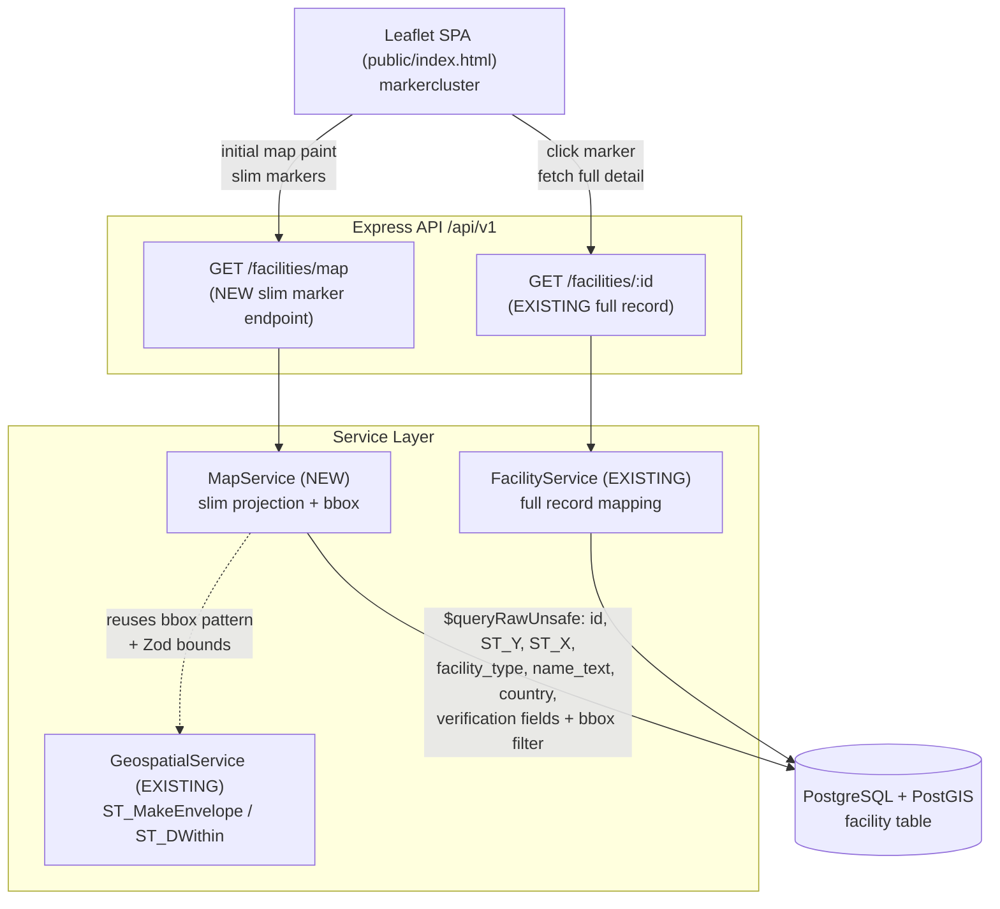
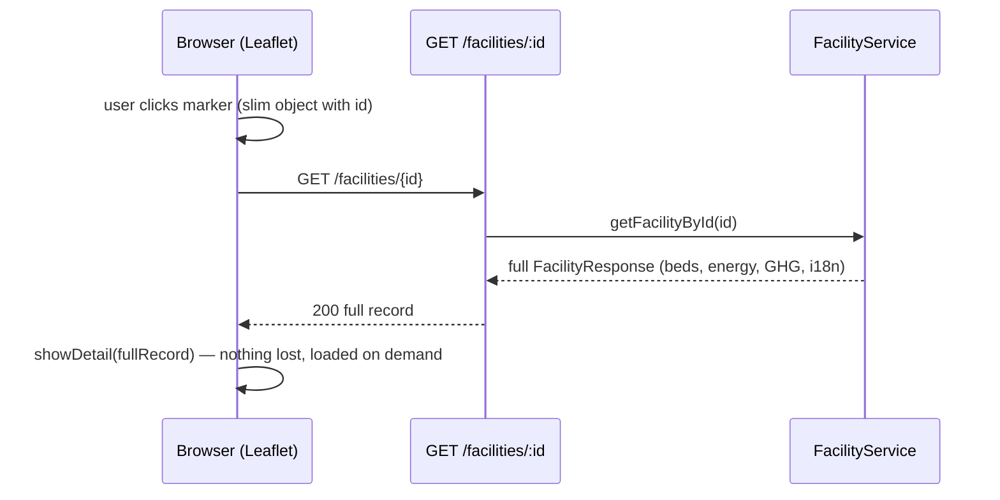
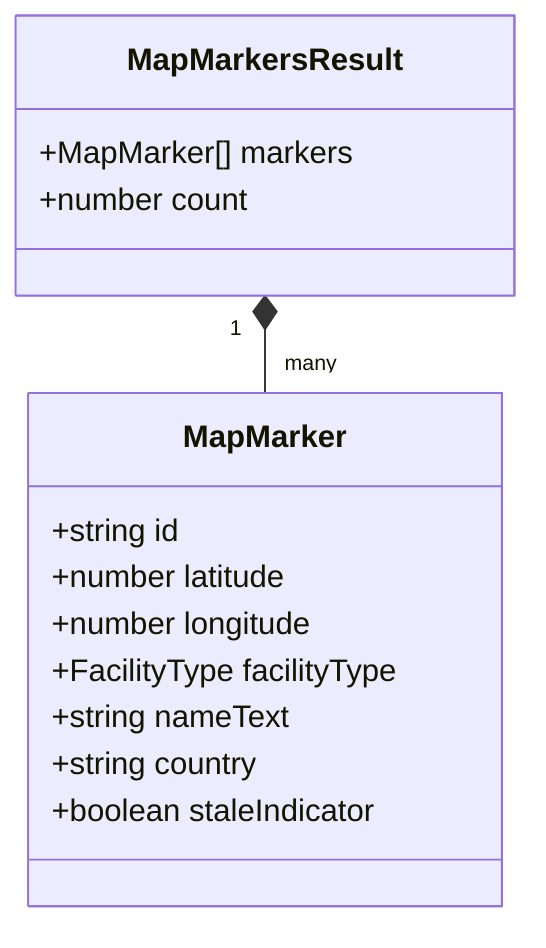

# Design Document: Lightweight Map Endpoint

## Overview

The map view in `public/index.html` currently renders Leaflet markers by pulling **full** facility records (multilingual JSONB names/addresses, energy profiles, GHG data, beds, contact info) through `GET /api/v1/facilities` — thousands of heavy records just to plot dots. This design adds a dedicated **slim map endpoint** (`GET /api/v1/facilities/map`) that returns only the fields needed to draw and label a marker (`id`, `latitude`, `longitude`, `facilityType`, `nameText`, `country`, `staleIndicator`). Full detail is loaded **on demand** when a user clicks a marker, via the existing `GET /api/v1/facilities/:id` endpoint.

The endpoint reuses the established PostGIS bounding-box pattern (`ST_MakeEnvelope`) already present in `GeospatialService.findInBoundingBox`, the existing Zod geolocation bounds validation, the layered Routes → Service → Raw SQL architecture, the `ServiceResponse<T>` discriminated union, the `createXRouter(prisma)` factory pattern, `optionalAuth` for public reads, and soft-delete exclusion (`deleted_at IS NULL`). It adds server-side viewport loading (optional bbox) and HTTP caching (ETag / Cache-Control) so repeat loads and pan/zoom hit the browser cache instead of the database.

The design follows the project's TypeScript stack (Node.js, Express, Prisma v5, PostgreSQL + PostGIS, Zod, Vitest + fast-check + supertest). It integrates with — and does not duplicate — the existing `FacilityService` and `GeospatialService`.

---

## Architecture

_High-Level Design_

### System Context



The new `MapService` sits alongside the existing services. It reuses the PostGIS bbox technique from `GeospatialService` (`ST_MakeEnvelope(...)` + `ST_Intersects`) and the Zod bounds constants, but returns a **projection** (marker fields only) rather than full facility records. Full-record mapping stays exclusively in `FacilityService`.

### Component Fit

| Component | Status | Responsibility |
|-----------|--------|----------------|
| `GET /api/v1/facilities/map` | NEW route | Parse query params, delegate to `MapService`, set ETag/Cache-Control, map `ServiceResponse` to HTTP |
| `MapService.getMapMarkers(...)` | NEW service | Validate params (Zod), build slim raw SQL with optional bbox + filters + soft-delete exclusion, return `ServiceResponse<MapMarkersResult>` |
| `MapMarkersQuerySchema` | NEW Zod schema | Validate optional bbox corners (general world bounds) + optional filters (country, facilityType, operationalStatus) |
| `MapMarker` / `MapMarkersResult` types | NEW types in `src/types/` | Slim marker shape + response envelope |
| `GET /api/v1/facilities/:id` | EXISTING | Serves full detail for click-to-detail (no change) |
| `GeospatialService` bbox pattern | REUSED | `ST_MakeEnvelope` bounding-box filtering technique |
| Zod geo bounds (`GEO_LAT_MIN`…) | REUSED | Coordinate range validation |
| `optionalAuth` | REUSED | Public read access |

### Data Flow — Initial Map Load

```mermaid
sequenceDiagram
    participant U as Browser (Leaflet)
    participant R as GET /facilities/map
    participant S as MapService
    participant DB as PostGIS

    U->>R: GET /facilities/map?sw_lat&sw_lon&ne_lat&ne_lon&country&facilityType
    R->>R: read query params (bbox optional)
    R->>S: getMapMarkers({ bbox?, filters? })
    S->>S: validateInput(MapMarkersQuerySchema, params)
    alt invalid
        S-->>R: { success:false, error: VALIDATION_ERROR }
        R-->>U: 400 { error }
    else valid
        S->>DB: $queryRawUnsafe (SELECT slim cols WHERE deleted_at IS NULL [+ bbox] [+ filters])
        DB-->>S: rows (marker fields only)
        S-->>R: { success:true, data: { markers, count } }
        R->>R: compute ETag from payload; set Cache-Control
        alt If-None-Match matches
            R-->>U: 304 Not Modified
        else
            R-->>U: 200 { markers, count } (small payload)
        end
    end
    U->>U: markers.forEach(makeMarker) → cluster
```

### Data Flow — Click to Detail



## Data Models

### Slim Response Data Model (High-Level)



The slim marker deliberately **excludes** `beds`, `energyProfile`, `contactInfo`, GHG emissions, `addresses`, and the multilingual `names`/`addresses` JSONB. Only `nameText` (already a denormalized column used for the tooltip) is included.

### Core Types

New types added to `src/types/models.ts` (or a small `src/types/map.ts`) and re-exported via the barrel.

```typescript
import type { UUID } from './enums';
import type { FacilityType } from './enums';

/** Minimal facility projection for rendering a single map marker. */
export interface MapMarker {
  id: UUID;
  latitude: number;
  longitude: number;
  facilityType: FacilityType;
  /** Denormalized display name used for the hover tooltip. */
  nameText: string;
  country: string;
  /** True when verification is stale/unverified (drives marker styling). */
  staleIndicator: boolean;
}

/** Response envelope for the slim map endpoint. */
export interface MapMarkersResult {
  markers: MapMarker[];
  /** Number of markers returned (equals markers.length). */
  count: number;
}
```

---

## Components and Interfaces

_Low-Level Design (TypeScript)_

### Route Definition

New endpoint mounted under the existing `/api/v1` versioning, following the geospatial router factory pattern.

- **Path:** `GET /api/v1/facilities/map`
- **Auth:** `optionalAuth` (public read)
- **Placement:** New `src/routes/map.routes.ts` exporting `createMapRouter(prisma)`, registered in `src/routes/index.ts`. It MUST be mounted so `/facilities/map` is matched **before** any `/facilities/:id` pattern to avoid `:id` capturing the literal `map` segment (register the map router ahead of the facility router, mirroring how geospatial static paths are handled).

#### Query Parameters

| Param | Type | Required | Notes |
|-------|------|----------|-------|
| `sw_lat` | number | optional* | Bounding box SW latitude |
| `sw_lon` | number | optional* | Bounding box SW longitude |
| `ne_lat` | number | optional* | Bounding box NE latitude |
| `ne_lon` | number | optional* | Bounding box NE longitude |
| `country` | string | optional | Reuses `SearchFiltersSchema` country validation (African nation) |
| `facilityType` | enum | optional | `FacilityTypeSchema` |
| `operationalStatus` | enum | optional | `OperationalStatusSchema` |

\* Bounding box is **all-or-nothing**: either all four corners are provided (viewport mode) or none (global mode, subject to filters). Providing a partial set is a validation error.

### Zod Schema

Added to `src/validation/schemas.ts`, reusing the existing `GEO_LAT_MIN/MAX`, `GEO_LON_MIN/MAX` bounds, `FacilityTypeSchema`, `OperationalStatusSchema`, and the country refinement from `SearchFiltersSchema`.

```typescript
/**
 * Query params for the slim map endpoint.
 * Bounding box corners are all-or-nothing; filters are independent and optional.
 * Reuses general world geo bounds (same as BoundingBoxQuerySchema).
 */
export const MapMarkersQuerySchema = z
  .object({
    swLatitude: z.number().min(GEO_LAT_MIN).max(GEO_LAT_MAX).optional(),
    swLongitude: z.number().min(GEO_LON_MIN).max(GEO_LON_MAX).optional(),
    neLatitude: z.number().min(GEO_LAT_MIN).max(GEO_LAT_MAX).optional(),
    neLongitude: z.number().min(GEO_LON_MIN).max(GEO_LON_MAX).optional(),
    country: boundedString('Country')
      .refine((val) => (AFRICAN_COUNTRIES as readonly string[]).includes(val), {
        message: 'Country must be a recognized African nation',
      })
      .optional(),
    facilityType: FacilityTypeSchema.optional(),
    operationalStatus: OperationalStatusSchema.optional(),
  })
  .refine(
    (q) => {
      const corners = [q.swLatitude, q.swLongitude, q.neLatitude, q.neLongitude];
      const provided = corners.filter((c) => c !== undefined).length;
      return provided === 0 || provided === 4;
    },
    { message: 'Bounding box requires all four corners (sw_lat, sw_lon, ne_lat, ne_lon) or none' },
  );

export type MapMarkersQueryInput = z.infer<typeof MapMarkersQuerySchema>;
```

### Service Function Signature

New `src/services/map.service.ts`. Returns the project's `ServiceResponse<T>` discriminated union (never throws for expected errors), consistent with `GeospatialService`.

```typescript
import { PrismaClient } from '@prisma/client';
import { MapMarkersQuerySchema, validateInput } from '../validation/schemas';
import { ErrorCode, ERROR_CODES } from '../types/api';
import { ServiceResponse } from './facility.service';
import { MapMarker, MapMarkersResult } from '../types/models';

export class MapService {
  constructor(private readonly prisma: PrismaClient) {}

  /**
   * Return slim marker projections, optionally constrained to a bounding box
   * and/or filters. Excludes soft-deleted facilities. Ordered by name_text ASC
   * for deterministic output (stable ETags).
   *
   * @param query - Raw query params (bbox corners + optional filters)
   * @returns ServiceResponse<MapMarkersResult>
   */
  async getMapMarkers(query: unknown): Promise<ServiceResponse<MapMarkersResult>> { /* ... */ }
}
```

### Raw SQL — Slim Projection with Optional BBox + Soft-Delete Exclusion

Uses `$queryRawUnsafe` (like `GeospatialService`) because PostGIS geography needs raw SQL. The `WHERE` clause is assembled from a parameterized fragment list — **all values are passed as bound parameters** (`$1`, `$2`, …), never string-interpolated, to prevent SQL injection. Coordinates are extracted with `ST_Y`/`ST_X` on the geometry cast (same technique as `getFacilityById`).

```typescript
// Pseudocode of the query assembly inside getMapMarkers()
const conditions: string[] = ['f.deleted_at IS NULL'];
const params: unknown[] = [];
let p = 0;

// Optional bounding box (all-or-nothing, validated by schema)
if (data.swLatitude !== undefined) {
  conditions.push(
    `ST_Intersects(
       f.geolocation::geometry,
       ST_MakeEnvelope($${++p}, $${++p}, $${++p}, $${++p}, 4326)
     )`,
  );
  params.push(data.swLongitude, data.swLatitude, data.neLongitude, data.neLatitude);
}

// Optional filters
if (data.country !== undefined)          { conditions.push(`f.country = $${++p}`);            params.push(data.country); }
if (data.facilityType !== undefined)     { conditions.push(`f.facility_type = $${++p}`);      params.push(data.facilityType); }
if (data.operationalStatus !== undefined){ conditions.push(`f.operational_status = $${++p}`); params.push(data.operationalStatus); }

const sql = `
  SELECT
    f.id,
    ST_Y(f.geolocation::geometry) AS latitude,
    ST_X(f.geolocation::geometry) AS longitude,
    f.facility_type,
    f.name_text,
    f.country,
    f.verification_status,
    f.verification_date
  FROM facility f
  WHERE ${conditions.join(' AND ')}
  ORDER BY f.name_text ASC
`;

const rows = await this.prisma.$queryRawUnsafe<Array<{
  id: string; latitude: number; longitude: number;
  facility_type: string; name_text: string; country: string;
  verification_status: string; verification_date: Date | null;
}>>(sql, ...params);
```

The `staleIndicator` is derived in the service using the **existing** `computeStaleIndicator(verificationStatus, verificationDate)` helper exported from `facility.service.ts` — reusing the 24-month staleness rule rather than reimplementing it. `verification_status`/`verification_date` are selected only to compute the flag and are not returned to the client.

```typescript
const markers: MapMarker[] = rows.map((r) => ({
  id: r.id,
  latitude: r.latitude,
  longitude: r.longitude,
  facilityType: r.facility_type as FacilityType,
  nameText: r.name_text,
  country: r.country,
  staleIndicator: computeStaleIndicator(r.verification_status as VerificationMethod, r.verification_date),
}));

return { success: true, data: { markers, count: markers.length } };
```

### Response Shape

```json
{
  "markers": [
    {
      "id": "3f9a...",
      "latitude": 6.5244,
      "longitude": 3.3792,
      "facilityType": "hospital",
      "nameText": "Lagos General Hospital",
      "country": "Nigeria",
      "staleIndicator": false
    }
  ],
  "count": 1
}
```

Errors reuse the standard envelope `{ error: { code, message, details? } }` and `ERROR_HTTP_STATUS` mapping (validation failures → `VALIDATION_ERROR` → 400).

### ETag / Cache-Control Strategy

Applied in the route handler after a successful service call:

1. Compute a **strong-ish content ETag** by hashing the serialized payload (e.g., `crypto.createHash('sha1').update(json).digest('hex')`, wrapped in quotes). Deterministic ordering (`ORDER BY name_text ASC`) keeps the ETag stable across identical requests.
2. Set headers:
   - `ETag: "<hash>"`
   - `Cache-Control: public, max-age=60` (short TTL; markers are read-mostly and mutations are infrequent). A conservative 60s keeps pan/zoom snappy while bounding staleness.
3. If the request carries `If-None-Match` equal to the computed ETag, respond `304 Not Modified` with no body.

```typescript
router.get('/facilities/map', optionalAuth, async (req, res) => {
  const result = await mapService.getMapMarkers({
    swLatitude: req.query.sw_lat ? Number(req.query.sw_lat) : undefined,
    swLongitude: req.query.sw_lon ? Number(req.query.sw_lon) : undefined,
    neLatitude: req.query.ne_lat ? Number(req.query.ne_lat) : undefined,
    neLongitude: req.query.ne_lon ? Number(req.query.ne_lon) : undefined,
    country: req.query.country,
    facilityType: req.query.facilityType,
    operationalStatus: req.query.operationalStatus,
  });

  if (!result.success) {
    const status = ERROR_HTTP_STATUS[result.error.code as ErrorCode] ?? 500;
    return res.status(status).json({ error: result.error });
  }

  const body = JSON.stringify(result.data);
  const etag = `"${createHash('sha1').update(body).digest('hex')}"`;
  res.setHeader('ETag', etag);
  res.setHeader('Cache-Control', 'public, max-age=60');
  if (req.headers['if-none-match'] === etag) return res.status(304).end();
  res.status(200).type('application/json').send(body);
});
```

### Frontend Changes (`public/index.html`)

Two functions change; the marker/tooltip/styling code (`makeMarker`, `makeTooltip`, `getTypeColor`) works unchanged because the slim payload already provides `geolocation`-equivalent fields, `facilityType`, `nameText`, `country`, and `staleIndicator`.

**1. `loadMapMarkers()` — call the slim endpoint (optionally with viewport bounds):**

```javascript
async function loadMapMarkers() {
  const mapLoading = document.getElementById('map-loading');
  mapLoading.classList.add('visible');

  const b = map.getBounds(); // Leaflet viewport
  const bbox = `sw_lat=${b.getSouth()}&sw_lon=${b.getWest()}&ne_lat=${b.getNorth()}&ne_lon=${b.getEast()}`;
  const filterParams = getFilterParams();
  const typeParam = selectedType ? `&facilityType=${selectedType}` : '';
  const url = `${API_BASE}/facilities/map?${bbox}${filterParams}${typeParam}`;

  try {
    const resp = await fetch(url);              // 304s served from browser cache
    const data = await resp.json();             // { markers, count }
    Object.values(typeLayers).forEach(l => l.clearLayers());
    clusterGroup.clearLayers();
    directLayer.clearLayers();

    data.markers.forEach(m => {
      const marker = makeMarker(normalizeMarker(m)); // adapt {latitude,longitude} -> geolocation
      const layer = typeLayers[m.facilityType] || typeLayers.clinic;
      layer.addLayer(marker);
    });
    rebuildCluster();
  } catch (err) {
    console.error('Failed to load map markers:', err);
  } finally {
    mapLoading.classList.remove('visible');
  }
}

// Adapter so existing makeMarker/makeTooltip (which read f.geolocation) keep working.
function normalizeMarker(m) {
  return { ...m, geolocation: { latitude: m.latitude, longitude: m.longitude } };
}
```

The multi-page background loop is removed: one slim request per viewport replaces up to six full-record pages. Optionally bind `loadMapMarkers` to the Leaflet `moveend` event for true viewport-driven loading.

**2. `selectFacilityFromMap(f)` — fetch full detail on click (fetch-on-click):**

```javascript
async function selectFacilityFromMap(f) {
  selectedId = f.id;
  renderList();
  try {
    const resp = await fetch(`${API_BASE}/facilities/${f.id}`); // EXISTING full endpoint
    const full = await resp.json();
    showDetail(full); // beds, energy, GHG, contact — nothing lost, loaded on demand
  } catch (err) {
    console.error('Failed to load facility detail:', err);
  }
  const card = document.querySelector('.facility-card.active');
  if (card) card.scrollIntoView({ behavior: 'smooth', block: 'center' });
}
```

## Correctness Properties

_For Property-Based Testing with fast-check_

Property tests assert behavior over randomized facility datasets and query params.

### Property 1: Slim Shape — Exact Fields, No Leakage
For every marker in the response, its key set equals exactly `{id, latitude, longitude, facilityType, nameText, country, staleIndicator}`. No marker contains `beds`, `energyProfile`, `contactInfo`, GHG fields, `addresses`, or the multilingual `names` object.

Formal statement:
```
for all m in markers: keys(m) == {id, latitude, longitude, facilityType, nameText, country, staleIndicator}
```

**Validates: Requirements 1.1, 1.2, 1.4, 11.1**

### Property 2: BBox Containment
When all four bbox corners are supplied, every returned marker's coordinates lie within the envelope.

Formal statement:
```
for all m in markers: sw_lon <= m.longitude <= ne_lon and sw_lat <= m.latitude <= ne_lat
```

**Validates: Requirements 2.1, 2.2, 11.2**

### Property 3: Soft-Delete Exclusion
No facility with a non-null `deletedAt` appears in the result, for any query.

Formal statement:
```
for all m in markers: facility(m.id).deletedAt == null
```

**Validates: Requirements 5.1**

### Property 4: Subset Consistency With the Full List
Under identical filters (and no bbox, or a bbox covering all data), the set of marker `id`s equals the set of facility `id`s returned by the existing full facility listing.

Formal statement:
```
{ m.id for m in mapMarkers(filters) } == { f.id for f in fullFacilities(filters) }
```

**Validates: Requirements 2.3, 4.1, 4.2, 4.3, 6.1**

### Property 5: Field Agreement
For each marker, `nameText`, `facilityType`, `country`, `staleIndicator`, and coordinates match the corresponding full record from `GET /facilities/:id`.

**Validates: Requirements 1.3, 6.2**

### Property 6: All-or-Nothing BBox Validation
Any query supplying 1–3 bbox corners yields `VALIDATION_ERROR` (400); 0 or 4 corners are accepted.

**Validates: Requirements 3.1, 3.2**

### Property 7: Count Invariant
The response count field equals the length of the markers array.

Formal statement:
```
response.count == length(response.markers)
```

**Validates: Requirements 7.1, 7.2**

### Property 8: ETag Stability & 304
Two identical requests produce the same ETag; a follow-up request with matching `If-None-Match` yields `304` and an empty body.

**Validates: Requirements 8.1, 8.2, 8.3, 8.4**

## Error Handling

| Scenario | Condition | Response |
|----------|-----------|----------|
| Invalid coordinate range | corner outside general world bounds | 400 `VALIDATION_ERROR` with per-field `details` |
| Partial bbox | 1–3 corners supplied | 400 `VALIDATION_ERROR` |
| Invalid enum/country | bad `facilityType`/`operationalStatus`/`country` | 400 `VALIDATION_ERROR` |
| Unexpected DB error | raw SQL failure | Propagates to centralized `errorHandler` → 500 |
| Empty result | no facilities match | 200 `{ markers: [], count: 0 }` |

## Testing Strategy

- **Unit (Vitest):** `MapService.getMapMarkers` with a mocked/injected Prisma client — validation branches, WHERE-clause assembly (correct parameter binding), `staleIndicator` derivation, empty result.
- **Property-based (fast-check):** properties 1–8 above over generated facility sets and query params.
- **Integration (supertest):** `GET /api/v1/facilities/map` — 200 slim payload, bbox filtering, filter combinations, 400 on partial bbox, ETag header present, `If-None-Match` → 304, soft-deleted excluded, public access via `optionalAuth`.

## Performance Considerations

- Payload shrinks from full records (multilingual JSONB, energy arrays, GHG, contact) to seven scalar fields per marker — a large reduction enabling fast initial paint.
- Server-side bbox filtering caps rows to the current viewport, so the map scales without pulling all facilities globally.
- `Cache-Control` + `ETag` let repeated pans/zooms and page reloads hit the browser cache or short-circuit with `304`, reducing DB load.
- Existing spatial GiST index on `facility.geolocation` (used by `GeospatialService`) accelerates the `ST_Intersects` bbox filter.

## Security Considerations

- All query values are bound as SQL parameters (`$1…$n`) in `$queryRawUnsafe`; the only interpolated text is a fixed, code-controlled set of condition fragments — no user input is concatenated into SQL.
- `optionalAuth` preserves the existing public-read policy; no privileged data is exposed (the slim projection is a strict subset of already-public read fields).
- Soft-deleted records are always excluded.

## Dependencies

- No new runtime dependencies. Uses Node's built-in `crypto` for ETag hashing, plus existing Express, Prisma, PostGIS, and Zod.
- Registers the new router in `src/routes/index.ts`; adds `src/services/map.service.ts`, `src/routes/map.routes.ts`, the `MapMarkersQuerySchema`, and the `MapMarker`/`MapMarkersResult` types.
